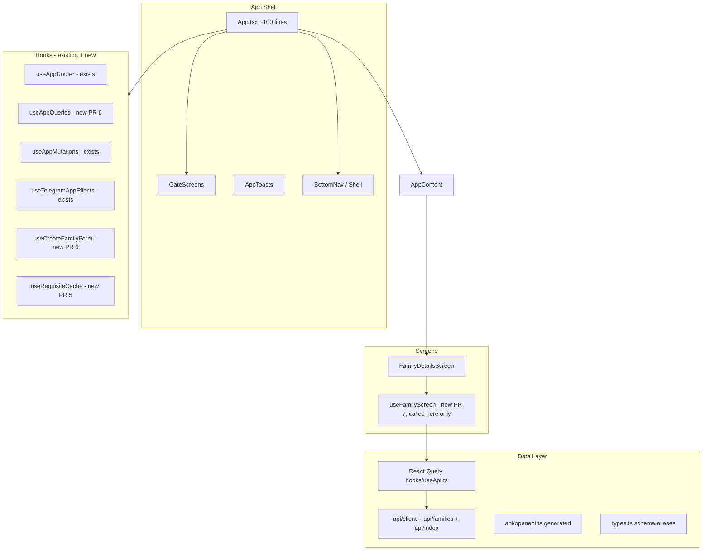
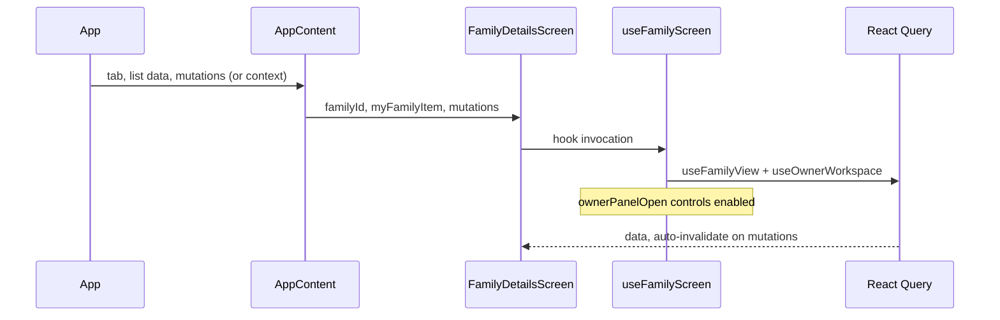

# Complete the Frontend Refactor — Subsmarket 3.0 Telegram Mini App

| Field | Value |
|-------|-------|
| **Author** | Assign before kickoff (frontend owner) |
| **Reviewers** | TBD — at least one senior engineer familiar with `useApi.ts` / E2E |
| **Tracking** | TBD — link GitHub issue/epic (e.g. `subsmarket-3.0#frontend-refactor`) |
| **Date** | 2026-06-25 |
| **Status** | Draft (revised post-review) |
| **Scope** | Finish in-progress frontend refactor to production-ready, maintainable structure |

---

## Overview

Subsmarket 3.0’s Telegram Mini App frontend has undergone a partial refactor: `App.tsx` was reduced from ~694 lines to **343**, server state moved to React Query (`hooks/useApi.ts`), and large UI surfaces were split into `components/`, `screens/`, and `hooks/`. The app is functional — build and 7 Playwright E2E tests are green — but several structural debts remain: a monolithic root component with heavy prop drilling, a dual API layer (`api.ts` + generated `api/openapi.ts`), manual owner-workspace state that bypasses existing React Query hooks, duplicate label modules, and a leftover `families.tsx` re-export shim.

This design describes how to **complete** the refactor incrementally (no big-bang rewrite), converging on a target architecture where `App.tsx` is a thin shell (~80–120 lines), API access lives under `api/` with shared transport, owner workspace data is React Query–backed with **lazy panel semantics preserved**, screens own their action wiring, and E2E stability is preserved PR-by-PR with **CI enforcement**.

---

## Background & Motivation

### Current state (measured 2026-06-25)

| Area | State | Lines / files |
|------|-------|---------------|
| Root orchestration | `App.tsx` still owns queries, filters, create-form state, dev auth, invite deep-link, Telegram effects, undo removal | **343 lines** |
| Screen routing | `components/AppContent.tsx` lazy-loads screens, passes 30+ props, inline mutation wrappers | 389 lines |
| Server state | React Query in `hooks/useApi.ts` — ~30 query/mutation hooks, centralized `queryKeys` | 411 lines |
| Owner workspace | `hooks/useOwnerDetails.ts` (`useOwnerWorkspace`) — manual `useState` + `loadOwnerDetails()` | 61 lines |
| API layer | `api.ts` — hand-written fetch + idempotency; `api/openapi.ts` — generated types only | 356 + 4048 lines |
| Domain types | `types.ts` already aliases `components["schemas"]` from OpenAPI | Good foundation |
| Families UI | Split into `components/families/*`; `families.tsx` is 4-line re-export shim | Shim redundant |
| Labels | `labels.ts` (170), `components/families/labels.ts`, `screens/family-details/labels.ts` | `paymentKindText` duplicated |
| E2E | 7 tests (`family-flow.spec.ts` × 6, `tma-smoke.spec.ts` × 1) | Stable, force-click convention |
| Hygiene | 7 `.tmp-*.png` screenshots in `frontend/` root | Should be removed + gitignored |
| CI | `.github/workflows/` has backend/security/load jobs only — **no frontend build or Playwright** | Manual local gates only today |

### Owner workspace: verified current behavior

`onLoadOwnerDetails` is **not** called on mount. Verified call sites (6 files):

| File | Trigger |
|------|---------|
| `screens/my-families/OwnerActions.tsx` | `owner-details-button` click (`data-testid`) |
| `components/AppContent.tsx` | 9 post-mutation `.then(() => onLoadOwnerDetails(familyId))` chains |
| `App.tsx` | Undo-removal handler after `revokeRemovalMutation` |
| `App.tsx`, `AppContent.tsx`, `FamilyDetailsScreen.tsx`, `FamilyWorkspacePanel.tsx` | Prop threading only |

`FamilyWorkspacePanel.tsx` renders `<OwnerDetails>` only when `ownerDetails` is truthy (line 155). Until the button is clicked and `loadOwnerDetails` completes, the panel is hidden. E2E tests 1, 5, and 6 explicitly click `owner-details-button` before owner-panel interactions.

### Pain points

1. **Duplicate data paths for owner workspace.** `useApi.ts` already exposes `useOwnerFamilyRequests`, `useFamilyMembers`, and `useFamilyMemberPayments` — but `useOwnerDetails.ts` re-fetches manually into `useState`. Nine post-mutation `onLoadOwnerDetails` chains in `AppContent.tsx` paper over incomplete React Query invalidation.

2. **Stale invalidation vs. AGENTS.md.** AGENTS.md §13 claims `useRevokeMemberRemoval` invalidates `familyView`, but **`useApi.ts` lines 367–370 do not** — only `ownerRequests` + `familyMembers`. Similar gaps exist for `useScheduleMemberRemoval`, `useMarkPaymentNotReceived`, and `useRecordOwnerPrepaidPeriods` (see audit table below). Removing manual refresh without fixing these will regress UI.

3. **Prop drilling / god components.** `App.tsx` → `AppContent.tsx` → `FamilyDetailsScreen.tsx` passes bundles of query data, loading flags, and 20+ callbacks.

4. **API layer split-brain.** `types.ts` is OpenAPI-derived; runtime calls are hand-written in `api.ts`.

5. **Label drift.** `paymentKindText` duplicated in two label files.

---

## Goals & Non-Goals

### Goals

- Reduce `App.tsx` to a thin composition root (**target: ≤120 lines**; ~220 lines to extract from current 343).
- Eliminate manual `loadOwnerDetails` refresh paths; owner workspace reads from React Query **while preserving lazy panel UX**.
- Fix invalidation gaps in `useApi.ts` before removing manual refresh; reconcile AGENTS.md with code.
- Consolidate API transport under `frontend/src/api/` with stable public exports.
- Remove `families.tsx` shim; unify labels; add CI gate for build + E2E.
- Preserve **green build + 7 E2E tests** on every PR.

### Non-Goals

- Full `openapi-fetch` migration (optional late PR).
- Eager owner-panel fetch on every family-screen visit (would change UX/network).
- Backend API changes.
- Marketplace Engine UI.

---

## Proposed Design

### Target architecture



### Target folder structure

Legend: **(exists)** = in repo today; **(new)** = introduced by this refactor.

```
frontend/src/
  api/
    client.ts          (new) request(), authHeaders(), idempotency
    families.ts        (new)
    identity.ts        (new)
    catalog.ts         (new)
    dev.ts             (new)
    index.ts           (new) public re-exports
    openapi.ts         (exists) generated
  hooks/
    useApi.ts          (exists)
    useAppMutations.ts (exists)
    useAppQueries.ts   (new) PR 6
    useCreateFamilyForm.ts (new) PR 6
    useFamilyScreen.ts (new) PR 7 — single call site: FamilyDetailsScreen
    useOwnerWorkspace.ts (new) PR 5 — React Query composition
    useRequisiteCache.ts (new) PR 5 — requisites client cache
    useTelegramAppEffects.ts (exists)
    useOwnerDetails.ts (exists) — deleted in PR 5
  labels/              (new) PR 3
  navigation/
    useAppRouter.ts    (exists)
  providers/
    AppContext.tsx     (new, optional) PR 8 — only if prop reduction insufficient
  components/families/ (exists)
  App.tsx              (exists)
```

**Not in initial scope:** `hooks/useDevAuth.ts` — dev auth (`devUser`, `switchDevUser`) stays inline in `App.tsx` through PR 7; extraction is an optional follow-up (see PR 12).

### State ownership model

| State | Owner | Mechanism |
|-------|-------|-----------|
| `me`, services, families, myFamilies, myRequests | `useAppQueries` (PR 6) | React Query |
| `familyView`, audit, invite | `useFamilyScreen` (PR 7) | React Query, `enabled` by `familyId` |
| Owner requests, members, payments | `useOwnerWorkspace` (PR 5) | Composed React Query hooks |
| **`ownerPanelOpen`** (UI) | `useFamilyScreen` or `FamilyDetailsScreen` | `useState` — **controls lazy fetch** |
| Payment requisites | `useRequisiteCache` (PR 5) | `useState` map; `storeRequisite` / `resetRequisiteCache` |
| Tab, selectedFamilyId | `useAppRouter` | `useState` |
| Create-family form | `useCreateFamilyForm` (PR 6) | `useState` |
| busy, error, toast | `useAppMutations` | `useState` |
| familyType, filters | `useAppQueries` | `useState` + memoized lists |
| undoRemoval | `App.tsx` / `AppToasts` | `useState` (8s UI window) |
| devUser | `App.tsx` (until optional PR 12) | `useState` + localStorage |

### Non-query workspace state (PR 5 migration plan)

| Concern | Current (`useOwnerDetails.ts`) | Target | Notes |
|---------|-------------------------------|--------|-------|
| `ownerDetails` | `useState<Record<string, OwnerFamilyDetails>>` | **Removed** — derived from `useOwnerWorkspace` | Per-family keyed cache replaced by React Query |
| `requisites` | `useState<Record<string, PaymentRequisite>>` | `hooks/useRequisiteCache.ts` | `storeRequisite(memberId, req)` unchanged surface |
| `resetWorkspace()` | Clears ownerDetails + requisites | `resetRequisiteCache()` + `queryClient.removeQueries` for owner keys | Called on dev-user switch |
| `loadOwnerDetails()` | Manual `Promise.all` fetch | **Deleted** | Replaced by query `enabled` + invalidation |
| Dev-user switch (`App.tsx` ~141) | `workspace.resetWorkspace()` + `queryClient.clear()` | `resetRequisiteCache()` + `queryClient.clear()` | Keep `queryClient.clear()` — already correct |

```typescript
// hooks/useRequisiteCache.ts (new, PR 5)
export function useRequisiteCache() {
  const [requisites, setRequisites] = useState<Record<string, PaymentRequisite>>({});
  const storeRequisite = useCallback((memberId: string, requisite: PaymentRequisite) => {
    setRequisites((c) => ({ ...c, [memberId]: requisite }));
  }, []);
  const resetRequisiteCache = useCallback(() => setRequisites({}), []);
  return { requisites, storeRequisite, resetRequisiteCache };
}
```

### Owner workspace: migrate to React Query (lazy semantics preserved)

**Decision A (chosen): Preserve lazy load.** Do **not** eagerly fetch owner queries when an owner opens the family screen. Match current UX: owner sees settings card first; clicks **«Заявки и участники»** to reveal `OwnerDetails`.

#### UI + fetch contract

1. **`ownerPanelOpen: boolean`** — `useState` in `useFamilyScreen` (or `FamilyDetailsScreen`). Default `false`; reset to `false` when `familyId` changes or family screen closes.
2. **Query `enabled`** — owner queries run only when:
   ```typescript
   enabled = familyId !== null && isOwner && ownerPanelOpen;
   ```
   where `isOwner = familyView?.my_membership?.role === "owner"`.
3. **Button behavior** (`OwnerActions.tsx`, `data-testid="owner-details-button"`):
   - First click: `setOwnerPanelOpen(true)` → queries enable → fetch starts.
   - Subsequent clicks (panel already open): optional `refetch()` for manual refresh; keep button label unchanged for E2E stability.
   - Replace `onLoadOwnerDetails` prop with `onOpenOwnerPanel: () => void`.
4. **Panel visibility** (`FamilyWorkspacePanel.tsx`):
   ```tsx
   {ownerPanelOpen && (
     ownerWorkspace.isPending ? (
       <PanelSkeleton />
     ) : ownerWorkspace.isError ? (
       <OwnerPanelError errors={ownerWorkspace.errors} onRetry={() => void ownerWorkspace.refetch()} />
     ) : ownerWorkspace.details ? (
       <>
         {ownerWorkspace.isFetching ? <p className="muted owner-panel-refresh">Обновляем…</p> : null}
         <OwnerDetails details={ownerWorkspace.details} ... />
       </>
     ) : null
   )}
   ```
   - **`isPending`** — initial load after panel opens (matches `OwnerWorkspaceStatus`, React Query v5).
   - **`isFetching`** — background refresh after mutation invalidation; show subtle indicator, keep `OwnerDetails` mounted.
   - **Errors** — use new `OwnerPanelError` (PR 5), not global `AppErrorBanner` (shell-level `mutations.error` only).
   Do **not** use `{ownerDetails ? <OwnerDetails /> : null}` alone — that hid the panel until manual fetch completed; with lazy `enabled`, `details` is undefined until panel opens **and** queries succeed.

5. **`OwnerPanelError`** (`components/families/OwnerPanelError.tsx`, new in PR 5):
   ```tsx
   export function OwnerPanelError({
     errors,
     onRetry
   }: {
     errors: (Error | null)[];
     onRetry: () => void;
   }) {
     const message = errors.find(Boolean)?.message ?? "Не удалось загрузить данные владельца";
     return (
       <div className="inline-error owner-panel-error" role="alert">
         <p>{message}</p>
         <button type="button" className="secondary" onClick={onRetry}>
           Повторить
         </button>
       </div>
     );
   }
   ```
   Reuses existing `.inline-error` styling from `AppErrorBanner` (`components/AppToasts.tsx`) but stays scoped to the owner panel with an explicit retry action.

#### `useOwnerWorkspace` hook — complete interface

```typescript
// hooks/useOwnerWorkspace.ts
export type OwnerWorkspaceStatus = {
  details: OwnerFamilyDetails | undefined;
  isPending: boolean;       // any query pending (no cached data yet)
  isFetching: boolean;      // background refetch after invalidation
  isError: boolean;
  errors: (Error | null)[]; // per-query errors [requests, members, payments]
  refetch: () => Promise<unknown[]>;
};

export function useOwnerWorkspace(
  familyId: string | null,
  enabled: boolean
): OwnerWorkspaceStatus {
  const requests = useOwnerFamilyRequests(enabled ? familyId : null);
  const members = useFamilyMembers(enabled ? familyId : null);
  const payments = useFamilyMemberPayments(enabled ? familyId : null);

  const details = useMemo<OwnerFamilyDetails | undefined>(() => {
    if (!familyId) return undefined;
    // Use isSuccess — empty arrays [] are valid data, not "missing"
    if (!requests.isSuccess || !members.isSuccess || !payments.isSuccess) {
      return undefined;
    }
    return {
      requests: requests.data,
      members: members.data,
      paymentsByMemberId: Object.fromEntries(
        payments.data.map((item) => [item.member_id, item.payments])
      )
    };
  }, [familyId, requests.isSuccess, requests.data, members.isSuccess, members.data, payments.isSuccess, payments.data]);

  return {
    details,
    isPending: requests.isPending || members.isPending || payments.isPending,
    isFetching: requests.isFetching || members.isFetching || payments.isFetching,
    isError: requests.isError || members.isError || payments.isError,
    errors: [
      requests.error ?? null,
      members.error ?? null,
      payments.error ?? null
    ],
    refetch: () => Promise.all([requests.refetch(), members.refetch(), payments.refetch()])
  };
}
```

**Error UX:** If one query fails, render `OwnerPanelError` inside the panel (not `AppErrorBanner` — that is for global mutation errors in `App.tsx`). Retry calls `refetch()`.

**React Query v5 note:** When `enabled: false`, `isPending` is `false` — correct for closed panel. Use `isFetching` to show subtle refresh indicator after mutations while panel is open.

#### Mutation invalidation audit (verified against `useApi.ts` 2026-06-25)

**AGENTS.md §13 is stale** — code does not match doc for `useRevokeMemberRemoval`.

| Mutation hook | ownerRequests | familyMembers | familyMemberPayments | familyView | Action in PR 5 |
|---------------|:---:|:---:|:---:|:---:|------|
| `useApproveFamilyRequest` | ✓ | ✓ | — | ✓ | OK |
| `useRejectFamilyRequest` | ✓ | ✓ | — | ✓ | OK |
| `useMarkAccessProvided` | ✓ | ✓ | — | ✓ | OK |
| `useRemindAccessConfirmation` | — | ✓ | — | — | OK (member-only) |
| `useCancelMemberBeforeAccess` | ✓ | ✓ | — | — | OK |
| `useScheduleMemberRemoval` | ✓ | ✓ | — | **—** | **Add `familyView`** |
| `useRevokeMemberRemoval` | ✓ | ✓ | — | **—** | **Add `familyView`** (undo flow) |
| `useConfirmPaymentReceived` | ✓ | ✓ | — | ✓ | **Add `familyMemberPayments`** |
| `useMarkPaymentNotReceived` | ✓ | ✓ | — | **—** | **Add `familyView` + `familyMemberPayments`** |
| `useRecordOwnerPrepaidPeriods` | ✓ | ✓ | **—** | — | **Add `familyMemberPayments`** |

**PR 5 acceptance:** Grep `onLoadOwnerDetails` → **zero matches**. Grep `loadOwnerDetails` → **zero matches**. All gaps in table above fixed. AGENTS.md §12–13 updated to match code.

**Checklist artifact:** Add `frontend/docs/invalidation-checklist.md` (or comment block in `useApi.ts`) listing each owner-affecting mutation and required invalidations — reviewer can diff against `invalidateQueries` calls.

### API layer consolidation

#### Phase A: Physical split (PR 4)

| New file | Contents from `api.ts` |
|----------|------------------------|
| `api/client.ts` | `request`, `post`, `patch`, `postIdempotent`, `authHeaders`, idempotency |
| `api/dev.ts` | Dev telegram user helpers |
| `api/identity.ts` | `getMe`, `refreshTelegramProfile` |
| `api/catalog.ts` | catalog endpoints |
| `api/families.ts` | all `/api/families/*` |
| `api/index.ts` | re-exports |

Temporary `api.ts` shim: `export * from "./api/index"` until PR 10.

#### Phase B: Typed client scaffold (optional PR 9)

- Merge window: **after PR 4, before PR 10** (shim deletion).
- Does not block required path; touch `api/client.ts` only via `api/typed.ts` wrapper.
- Run `npm run openapi:sync` when adding pilot endpoints.

### Slim `App.tsx` and `AppContent.tsx`

#### `useFamilyScreen` — single call site (PR 7)

**Call site:** `FamilyDetailsScreen.tsx` only — not `App.tsx`, not `AppContent.tsx`.

Rationale: `FamilyDetailsScreen` is lazy-loaded under `Suspense`, but hooks inside screen components are valid (Rules of Hooks satisfied — stable tree position per mount). Colocating `useFamilyView`, `useOwnerWorkspace`, `ownerPanelOpen`, and `useTelegramMainButton` avoids duplicate queries from split ownership.

**During PR 5–7 transition:**

| Data | Owner until PR 7 | Owner after PR 7 |
|------|------------------|------------------|
| `familyId` | Prop from `AppContent` (via router) | Prop from `AppContent` |
| `familyView`, audit, invite | `App.tsx` queries | `useFamilyScreen` |
| Owner workspace | `useOwnerWorkspace` in `FamilyDetailsScreen` (PR 5) | same |
| List queries (families, myFamilies) | `App.tsx` | `useAppQueries` (PR 6) |

#### Prop surface reduction (estimated)

| Stage | `AppContent` prop count (approx.) |
|-------|-----------------------------------|
| Today | **~32** props |
| After PR 5 | ~28 (remove `onLoadOwnerDetails`, simplify `ownerDetails`) |
| After PR 7 | **~15–18** (`useFamilyScreen` internalizes family-tab queries + actions) |
| After optional PR 8 (AppContext) | **~12–14** (remove `mutations`, `router` props) |

**PR 8 (AppContext) is optional** — proceed only if PR 7 leaves >18 props or adding a screen still requires editing 3 files. Prop drilling is acceptable for explicitness (see Key Decisions #7).



### Remove `families.tsx` shim (PR 2)

Update two consumers; delete `components/families.tsx`.

### Labels consolidation (PR 3)

Single `paymentKindText` in `labels/payments.ts`.

### Hygiene (PR 1)

- Delete 7 `frontend/.tmp-*.png` files.
- **No `frontend/.gitignore` exists today.** Add pattern to **root `.gitignore`**:

```
frontend/.tmp-*.png
```

Root `.gitignore` already has `.tmp/` but does not cover `frontend/.tmp-*.png` at repo root of frontend.

---

## API / Interface Changes

| Before | After |
|--------|-------|
| `onLoadOwnerDetails(familyId)` | **Removed** → `onOpenOwnerPanel()` toggles lazy fetch |
| `ownerDetails: Record<string, OwnerFamilyDetails>` | `useOwnerWorkspace(familyId, ownerPanelOpen)` per screen |
| `onStoreRequisite` from `useOwnerDetails` | `useRequisiteCache().storeRequisite` |
| `workspace.resetWorkspace()` | `resetRequisiteCache()` + `queryClient.clear()` |

### Hook additions

```typescript
// PR 5
export function useOwnerWorkspace(familyId: string | null, enabled: boolean): OwnerWorkspaceStatus;
export function useRequisiteCache(): { requisites; storeRequisite; resetRequisiteCache };

// PR 6
export function useAppQueries(): { ... };
export function useCreateFamilyForm(...): { ... };

// PR 7 — call only from FamilyDetailsScreen
export function useFamilyScreen(familyId: string | null): { ... };
```

### Context (optional PR 8)

```typescript
// providers/AppContext.tsx (optional)
type AppContextValue = {
  router: ReturnType<typeof useAppRouter>;
  mutations: ReturnType<typeof useAppMutations>;
};
```

---

## Data Model Changes

**None** — `OwnerFamilyDetails` composite shape in `types.ts` unchanged.

---

## Alternatives Considered

### Alternative A: Eager owner fetch on family screen visit

Enable queries when `isOwner && tab === 'family'` without button.

| Pros | Cons |
|------|------|
| Simpler `enabled` logic | 3 parallel requests on every owner visit; auto-shows panel (UX change) |
| No `ownerPanelOpen` state | Breaks lazy pattern; E2E still clicks button but behavior diverges |

**Rejected** — preserve lazy semantics (review Issue 1).

### Alternative B: Aggregated `GET /owner-dashboard`

**Deferred** — backend out of scope.

### Alternative C: Big-bang `AppContent` rewrite

**Rejected** — incremental PRs with E2E gates.

---

## Security & Privacy Considerations

Unchanged from prior draft: auth headers in `api/client.ts`, requisites not persisted, no `persistQueryClient`, idempotency preserved.

---

## Observability

| Signal | Approach |
|--------|----------|
| Local gate (all PRs) | `npm run build && npm run test:ui` |
| High-risk PRs (5–7) | **`npm run check`** from repo root (backend + frontend + E2E) |
| CI (PR 0) | GitHub Actions `frontend-check.yml` on `ubuntu-latest` — **after** cross-platform Playwright/scripts |
| Playwright infra | Today: Windows-only backend `webServer` (PowerShell + `.\.venv\Scripts\python.exe`). PR 0 ports this. |
| Local gate (PRs 5–7) | `npm run check` — Windows-oriented today; PR 0 adds POSIX support via `scripts/run-python.mjs` |
| React Query devtools | Optional, DEV only — recommended during PR 5 |

### CI workflow (PR 0) — cross-platform prerequisite

**Verified constraint (2026-06-25):** `frontend/playwright.config.ts` line 8–9 invokes **PowerShell** and `backend\.venv\Scripts\python.exe`. Root `package.json` `backend:*` and `npm run check` use the same Windows venv paths. A stock `ubuntu-latest` runner **cannot** run E2E until PR 0 ports tooling.

**PR 0 delivers two parts (same PR, atomic):**

#### Part A: Cross-platform local/CI tooling

| File | Change |
|------|--------|
| `scripts/run-python.mjs` (new) | Resolves venv Python: `backend/.venv/Scripts/python.exe` (win32) or `backend/.venv/bin/python` (posix); exits with clear error if venv missing |
| `package.json` | `backend:lint`, `backend:compile`, `backend:test`, etc. → `node scripts/run-python.mjs -m …` |
| `frontend/playwright.config.ts` | Platform branch for backend `webServer.command` — no PowerShell on Linux/macOS |

```typescript
// frontend/playwright.config.ts (target excerpt)
import { defineConfig } from "@playwright/test";
import { platform } from "node:os";

const isWin = platform() === "win32";
const python = isWin ? "..\\backend\\.venv\\Scripts\\python.exe" : "../backend/.venv/bin/python";

const backendCommand = isWin
  ? `powershell -NoProfile -ExecutionPolicy Bypass -Command "New-Item -ItemType Directory -Force ..\\.tmp | Out-Null; Remove-Item ..\\.tmp\\playwright-e2e.db -ErrorAction SilentlyContinue; ${python} -m subsmarket.dev.init_e2e_db; ${python} -m uvicorn subsmarket.main:app --host 127.0.0.1 --port 8001"`
  : `mkdir -p ../.tmp && rm -f ../.tmp/playwright-e2e.db && ${python} -m subsmarket.dev.init_e2e_db && ${python} -m uvicorn subsmarket.main:app --host 127.0.0.1 --port 8001`;

export default defineConfig({
  webServer: [
    { command: backendCommand, cwd: "../backend", /* env unchanged */ url: "http://127.0.0.1:8001/ready" },
    { command: "npm run dev -- --host 127.0.0.1 --port 5174", url: "http://127.0.0.1:5174/" }
  ]
});
```

**Alternatives considered for CI runner:**
- `runs-on: windows-latest` only — works without config port, but slower, costlier, and leaves macOS/Linux contributors blocked. **Rejected as sole solution.**
- CI deferral — **Rejected**; PR 0's purpose is automation.

#### Part B: GitHub Actions workflow (runs after Part A)

```yaml
# .github/workflows/frontend-check.yml
name: frontend-check
on:
  pull_request:
    paths: ['frontend/**', 'backend/**', 'package.json', 'scripts/run-python.mjs']
  push:
    branches: [main]
jobs:
  frontend:
    runs-on: ubuntu-latest
    steps:
      - uses: actions/checkout@v4
      - uses: actions/setup-node@v4
        with:
          node-version: "20"
          cache: npm
          cache-dependency-path: frontend/package-lock.json
      - uses: actions/setup-python@v5
        with:
          python-version: "3.12"
      - name: Install backend deps
        run: |
          python -m venv backend/.venv
          backend/.venv/bin/python -m pip install -e backend/
        # backend uses pyproject.toml (no requirements.txt)
      - name: Install frontend deps
        run: npm ci --prefix frontend
      - name: Install Playwright browsers
        run: npx playwright install --with-deps chromium
        working-directory: frontend
      - run: npm run build
      - run: npm run test:ui
```

**Gate mapping:**

| Context | Command | When |
|---------|---------|------|
| CI (all frontend PRs) | `npm run build && npm run test:ui` | Automated via workflow |
| Local — all PRs | `npm run build && npm run test:ui` | Windows, macOS, Linux after PR 0 |
| Local — PRs 5–7 | `npm run check` | Full backend + frontend + E2E; cross-platform after PR 0 |

`npm run check` remains the comprehensive local superset. Before PR 0, Windows developers use it as today; after PR 0, POSIX paths work via `run-python.mjs`.

---

## Rollout Plan

1. **PR 0:** CI workflow
2. **PRs 1–4:** zero behavior change
3. **PR 5:** atomic owner workspace migration (highest risk)
4. **PRs 6–7:** App decomposition
5. **PR 8:** optional AppContext
6. **PR 9:** optional typed client (after PR 4, before PR 10)
7. **PR 10:** delete `api.ts` shim + AGENTS.md

### Per-PR gate

```powershell
# All PRs
npm run build
npm run test:ui

# PRs 5, 6, 7 (behavioral / structural)
npm run check
```

### Rollback

Revert PR 5 if owner panel regresses. Do not ship PR 5 in a partial state (invalidation unfixed + manual refresh removed).

---

## Risks & Mitigations

| Risk | Severity | Mitigation |
|------|----------|------------|
| Owner panel stale after removing manual refresh | **High** | Fix invalidation table in same PR; E2E 1, 5, 6 |
| Eager fetch accidentally enabled | **High** | `ownerPanelOpen` guard; code review checklist |
| Partial query failure hides panel | Medium | Per-query error UI + `refetch()` |
| No CI → regressions slip through | **High** | PR 0 workflow (after cross-platform port) |
| PR 0 CI fails on Ubuntu | **High** | Do not merge `frontend-check.yml` without `playwright.config.ts` + `run-python.mjs` port |
| `owner-details-button` noop | **High** | `OwnerActions.tsx` in PR 5 scope; E2E |

---

## Open Questions

1. ~~AppContext vs props~~ → **Resolved:** PR 8 optional; prefer prop reduction via `useFamilyScreen` first (Decision #7).
2. **Split `useApi.ts` by domain?** Defer to optional PR 11.
3. **React Query Devtools in DEV?** Recommended for PR 5 author — not blocking.
4. ~~CI integration~~ → **Resolved:** PR 0 ports Playwright/`npm run check` cross-platform, then adds `frontend-check.yml` on `ubuntu-latest`.

---

## References

- `AGENTS.md` — §8, §12–13 (must reconcile in PR 5)
- `frontend/src/hooks/useApi.ts` — invalidation source of truth
- `frontend/src/screens/my-families/OwnerActions.tsx` — `owner-details-button`
- `frontend/src/screens/family-details/FamilyWorkspacePanel.tsx` — panel visibility gate
- `frontend/playwright.config.ts` — E2E webServer config (Windows-only until PR 0)
- `package.json` — `npm run check` script (Windows venv paths until PR 0)
- `scripts/run-python.mjs` — cross-platform venv resolver (new in PR 0)

---

## Key Decisions

| # | Decision | Rationale |
|---|----------|-----------|
| 1 | **Lazy owner panel preserved** via `ownerPanelOpen` + conditional `enabled` | Matches verified code; avoids 3 requests per visit and auto-reveal |
| 2 | **PR 5 is atomic** — invalidation fixes + hook + remove all manual refresh in one PR | Eliminates half-wired highest-risk window |
| 3 | **Fix invalidation before deleting `loadOwnerDetails`** | AGENTS.md claims ≠ code; gaps cause stale UI |
| 4 | **`useRequisiteCache` separate from `useOwnerWorkspace`** | Requisites are client-only sensitive cache, not server list |
| 5 | **`useFamilyScreen` called only in `FamilyDetailsScreen`** | Single hook call site; lazy Suspense safe |
| 6 | **AppContext optional (PR 8)** | Props acceptable after PR 7 (~15–18); context adds indirection |
| 7 | **Root `.gitignore` for `.tmp-*.png`** | `frontend/.gitignore` does not exist |
| 8 | **PR 0 = cross-platform tooling + CI** | Playwright/`npm run check` are Windows-only today; port scripts first, then `ubuntu-latest` workflow |
| 9 | **PR 10 depends on PR 4 only** | Shim deletion unrelated to AppContext |
| 10 | **`useDevAuth` deferred** | Not blocking; dev auth is ~15 lines in `App.tsx` |

---

## PR Plan

### PR 0: Cross-platform E2E tooling + CI workflow

**Files:**
- `scripts/run-python.mjs` (new) — resolve venv Python on win32 vs posix
- `package.json` — `backend:*` scripts use `run-python.mjs`
- `frontend/playwright.config.ts` — platform branch for backend `webServer` (remove PowerShell-only path on Linux)
- `.github/workflows/frontend-check.yml` (new) — full setup: venv, `npm ci`, `playwright install --with-deps`
- `AGENTS.md` — document cross-platform `npm run check`

**Dependencies:** None

**Description:** **Atomic PR.** Today `playwright.config.ts` (line 8–9) and `npm run check` use Windows PowerShell + `backend\.venv\Scripts\python.exe` — verified incompatible with `ubuntu-latest`. Part A ports tooling; Part B adds CI. Do not merge workflow without cross-platform config.

**Gate:** `npm run build && npm run test:ui` on **both** Windows (dev machine) and Ubuntu (CI). Verify `npm run check` passes locally after script port.

**E2E impact:** None (behavior unchanged); validates CI can run existing 7 tests

---

### PR 1: Frontend hygiene — remove temp screenshots

**Files:** Delete `frontend/.tmp-*.png` (7 files); **root** `.gitignore` — add `frontend/.tmp-*.png`

**Dependencies:** None

**Description:** No `frontend/.gitignore` in repo; use root `.gitignore`.

**E2E impact:** None

---

### PR 2: Remove `families.tsx` re-export shim

**Files:** `components/families.tsx` (delete), `SearchScreen.tsx`, `FamilyWorkspacePanel.tsx`

**Dependencies:** None

**E2E impact:** None

---

### PR 3: Consolidate labels module

**Files:** `labels/{index,status,payments,owner,audit}.ts`; update consumers; delete duplicate label files

**Dependencies:** None

**E2E impact:** None

---

### PR 4: Split `api.ts` into `api/` modules

**Files:** `api/{client,dev,identity,catalog,families,index}.ts`; `api.ts` temporary shim

**Dependencies:** None

**Gate:** `npm run build && npm run test:ui`

**E2E impact:** None

---

### PR 5: Owner workspace React Query migration (atomic)

**Files:**
- `hooks/useOwnerWorkspace.ts` (new)
- `hooks/useRequisiteCache.ts` (new)
- `hooks/useOwnerDetails.ts` (delete)
- `hooks/useApi.ts` — **invalidation fixes** per audit table
- `App.tsx` — `useRequisiteCache`, remove `loadOwnerDetails` / undo manual refresh
- `components/AppContent.tsx` — remove 9 `onLoadOwnerDetails` chains + prop
- `screens/FamilyDetailsScreen.tsx` — `ownerPanelOpen`, wire `useOwnerWorkspace`
- `screens/family-details/FamilyWorkspacePanel.tsx` — panel visibility (`isPending` / `isFetching` / `OwnerPanelError`)
- `components/families/OwnerPanelError.tsx` (new) — scoped error + retry; reuses `.inline-error` pattern
- `screens/my-families/OwnerActions.tsx` — `onOpenOwnerPanel` replaces `onLoadOwnerDetails`
- `AGENTS.md` — reconcile §12–13 with code
- `frontend/docs/invalidation-checklist.md` (new, optional)

**Dependencies:** PR 4 (preferred)

**Description:** Single atomic PR. Fix invalidation gaps **first**, introduce lazy `useOwnerWorkspace`, migrate requisites to `useRequisiteCache`, update `OwnerActions` button, delete all manual refresh. **Acceptance:** `rg onLoadOwnerDetails` → 0; `rg loadOwnerDetails` → 0.

**Gate:** `npm run check`

**E2E impact:** **High** — tests 1, 5, 6 (`owner-details-button`, undo snackbar)

---

### PR 6: Extract `useAppQueries` and `useCreateFamilyForm`

**Files:** `hooks/useAppQueries.ts`, `hooks/useCreateFamilyForm.ts`, `App.tsx`

**Dependencies:** PR 5

**Gate:** `npm run check`

**E2E impact:** Medium — tests 2, 3

---

### PR 7: Extract `useFamilyScreen` — single call site in `FamilyDetailsScreen`

**Files:** `hooks/useFamilyScreen.ts`, `FamilyDetailsScreen.tsx`, `AppContent.tsx`, `App.tsx`

**Dependencies:** PR 6

**Description:** Move `useFamilyView`, audit/invite enable logic, `useTelegramMainButton` join CTA into `useFamilyScreen`. **Hook invoked only inside `FamilyDetailsScreen`.** Target: `AppContent` ≤18 props.

**Gate:** `npm run check`

**E2E impact:** Medium — smoke + test 1

---

### PR 8 (optional): AppContext for router and mutations

**Files:** `providers/AppContext.tsx`, `App.tsx`, `AppContent.tsx`

**Dependencies:** PR 7

**Description:** **Contingent** — ship only if `AppContent` still has >18 props or team wants context for new screens. Provide `router` + `mutations` only.

**E2E impact:** Low

---

### PR 9 (optional): Typed API client scaffold

**Files:** `api/typed.ts`, `api/client.ts` (minimal touch), `AGENTS.md`

**Dependencies:** PR 4

**Merge window:** After PR 4, **before PR 10**. Does not block required path. Rebase onto `api/index.ts` imports only.

**E2E impact:** Low

---

### PR 10: Delete `api.ts` shim and update AGENTS.md

**Files:** `frontend/src/api.ts` (delete), `AGENTS.md`, stray imports

**Dependencies:** **PR 4** (required). PR 9 optional if typed client merged.

**Description:** Final API module layout docs. **No dependency on AppContext (PR 8).**

**E2E impact:** None

---

### PR 11 (optional): Split `useApi.ts` by domain

**Files:** `hooks/api/*`, `hooks/useApi.ts` re-export

**Dependencies:** PR 10

**E2E impact:** None

---

### PR 12 (optional): Extract `useDevAuth`

**Files:** `hooks/useDevAuth.ts`, `App.tsx`

**Dependencies:** PR 6

**Description:** Move `devUser` / `switchDevUser` out of `App.tsx`. Low priority.

---

**Total PRs:** **8 required** (PR 0–7, PR 10) + **4 optional** (PR 8, 9, 11, 12) = **8–12 PRs**

**Estimated timeline:** 2–3 PRs/week → **3–5 weeks** with CI from PR 0.